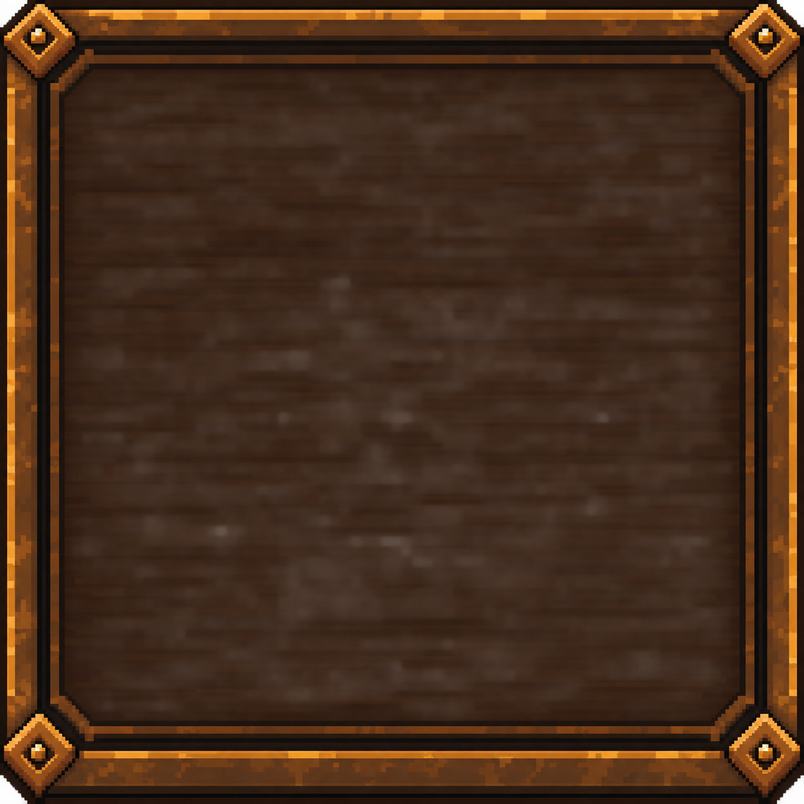
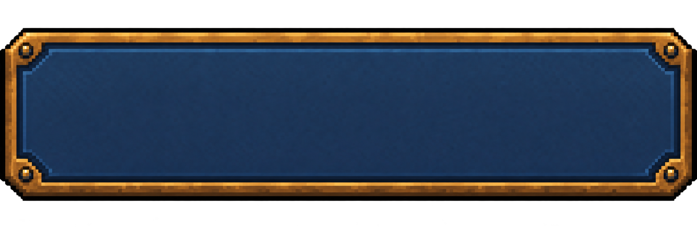
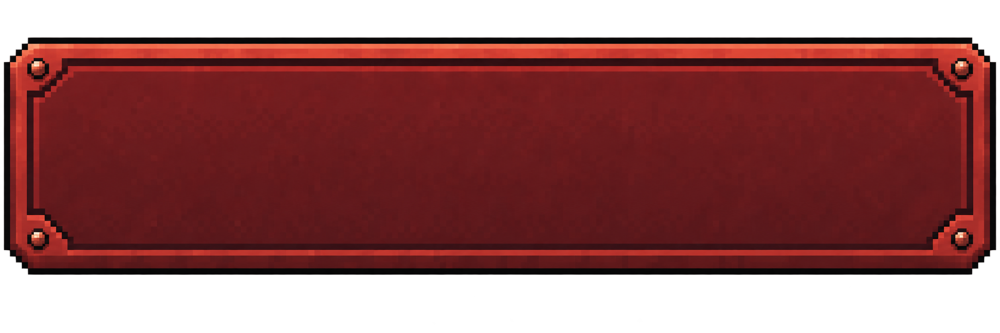

# GUILD24 공통 UI 컴포넌트 — 정의·적용 검토

> 검토 문서 / 디자인 브랜치 `ui/design-trim`
>
> 구현 기준: `d485fd1`. 설정은 구현 후보이며 실제 모바일 AFTER 검증과 최종 디자인 컨펌은 미완료다.
> 이 문서는 공통 부품의 역할, 현재 소스 위치, 적용 상태를 모은 검토용 카탈로그다.
> 새로운 Canonical owner나 전 화면 공통 스킨을 만들지 않는다. 아래 수치는 현 구현값 또는 명시된 검토 후보이며 전역 확정 규격이 아니다.

## 1. 기준 문서

| 결정할 내용 | 원본 |
|---|---|
| 프레임·정보면·주요 행동·제목·구획의 역할, 깊이와 상태 표현 | [PRESENTATION_PRINCIPLES — CONSTRUCTION](../design_ssot/PRESENTATION_PRINCIPLES_v2.8.0.md#construction) |
| 메뉴 구성, 설정 묶음, 아이콘·상세 배경 방향 | [UI_UX — MENU / SETTINGS](../design_ssot/UI_UX_v2.8.0.md#menu--settings--exact-composition) |
| 화면별 소재·모바일 배치·접근성·검증 조건 | [UI_UX](../design_ssot/UI_UX_v2.8.0.md) |
| 실제 버튼·모달·슬라이더 구현 | [ui.css](../dist/ui/ui.css), [app.js](../dist/ui/app.js) |
| PNG의 출처·크기·사용 범위 | [ASSETS](ASSETS.md) |

충돌 시 이 카탈로그를 근거로 원본 규칙이나 게임 동작을 바꾸지 않는다. 승인된 규칙 변경은 해당 owner에 반영한다.
이미지 시안, 실제 구현, 실제 화면 검증, 사용자 컨펌은 서로 다른 상태로 기록한다.

## 2. 공통 부품 목록

아래 이름은 문서에서 부품을 구분하기 위한 명칭이다. 새 프레임워크나 새 코드 API를 뜻하지 않는다.

| 부품 | 구조와 역할 | 적용·재사용 판단 | 현재 연결 |
|---|---|---|---|
| 외곽 오브젝트 | 화면을 담는 물체의 바깥선 + 내부 면 + 필요한 이음선 | 모달·게시판·발주서·영수증 각각의 물체를 유지한다. 완성된 프레임을 또 액자로 감싸지 않는다 | `.modal`; 설정 후보 `.settings-wood` |
| 헤더 / 제목 | 짧은 화면 이름 + 닫기 또는 뒤로 행동 | 제목과 닫기가 같은 헤더에 속한다. 본문 소제목을 모두 현판으로 만들지 않는다 | `.modal-header`, `h2`, `.bare` |
| 메뉴 행 | 메뉴 이름을 읽고 해당 화면으로 이동하는 버튼 | 같은 레벨의 행은 같은 정렬·깊이·크기 관계로 비교한다. 점포 포기 행은 일반 이동과 구분한다 | `.menu-list button`; PNG 아이콘 적용은 미완료 |
| 일반 조작 버튼 | 명시적인 행동 이름 + 누를 수 있는 면 + 눌림 표현 | 설정의 내보내기·가져오기·소리 전환 같은 동급 행동에 사용한다. 단계의 주요 결정을 뜻하는 버튼과 구분한다 | 설정 후보 `.settings-wood button:not(.bare)` |
| 주요 결정 버튼 | 현재 단계에서 결정을 확정하는 행동 | 기존 Phase별 행동과 소재를 따른다. 설정의 파란 PNG를 영업 시작·판매·마감에 일괄 적용하지 않는다 | 기존 `.stamp`와 Phase별 dock 규칙 |
| 위험 행동 버튼 | 위험 행동 이름 + 구별되는 면 + 기존 확인 절차 | 점포 포기와 전체 데이터 초기화를 혼동시키지 않는다. 시각 변경으로 확인 단계를 생략하지 않는다 | `.danger`, `retireConfirm`, `resetConfirm` |
| 섹션 구획 | 관련 정보·조작의 묶음 + 경계선/이음선 | 소리·저장·초기화 구획은 하나의 외곽 패널 안에서 나뉜다. 각 구획에 별도 카드 프레임을 추가하지 않는다 | `.settings-group`, `.settings-heading` |
| 정보 행 / 읽기 면 | 이름 + 값 또는 설명 | 조작 버튼의 깊이를 주지 않는다. 가격만 밝게 만들고 재고·기한·특성을 읽기 어렵게 두지 않는다 | 기존 readout·상품 정보; 설정 `.mix-row label`, `b` |
| 음량 슬라이더 | 연결된 라벨 + native range + 숫자 값 | 손잡이만으로 값을 전달하지 않는다. 조작 도중 범위 입력을 통째로 다시 그리지 않는다 | `mixer()`, `data-mix`, `--mix-level` |
| 메뉴 PNG 아이콘 | 한 메뉴의 의미를 식별하는 작은 이미지 | 이름을 보조한다. 제목에는 넣지 않고, 상세 설정의 모든 항목에도 반복하지 않는다 | 제작·구현 전 검토 단계 |
| 상세 메뉴 배경 PNG | 정보 역할이 없는 옅은 삽화 | 본문 뒤의 장식이다. 글자·조작을 가리거나 클릭을 받지 않는다. 점포 메뉴 행에는 적용하지 않는다 | 설정 `.settings-content::before` |

짧은 제목은 Mulmaru, 설명·조작 이름은 Wanted Sans, 숫자는 기존 숫자 역할을 재사용한다. 글자 크기와 모든 정보 행 높이를 전역 단일 값으로 고정하는 규칙은 추가하지 않는다.
점포 메뉴는 목재 내비게이션 행이고 설정의 파란 금속 버튼은 조작 버튼이다. 메뉴에 `.settings-wood`를 그대로 붙이는 방식은 재사용 범위 밖이다. 메뉴의 실제 가시 항목은 owner와 현재 `game.run` 조건을 따른다.

## 3. 상태별 표현

원본의 Action hierarchy / State grammar에 따른 적용 점검표다. 화면별로 새로운 상태 의미를 만들지 않는다.

| 상태 | 확인할 것 | 설정 후보 구현 |
|---|---|---|
| 기본 / 사용 가능 | 실제 행동 이름이 먼저 읽히고 조작 가능 여부가 보이는가 | PNG 버튼 면, 단단한 아래 깊이 |
| hover | 사용할 수 있는 행동에만 피드백이 붙는가 | 조작 버튼 밝기 조절 |
| 누름 | 색만 바뀌지 않고 깊이 또는 위치가 변하는가 | 아래로 이동하고 아래 깊이를 줄임 |
| 키보드 focus | 클릭 상태와 별도로 현재 키보드 위치를 찾을 수 있는가 | 버튼·입력의 `:focus-visible` |
| 비활성 | 행동은 실행되지 않고 필요한 이름·값은 읽히는가 | `disabled`와 `aria-disabled` 스타일을 확인. 실제 실행 차단은 이벤트 로직도 함께 점검 |
| 선택 / 보유 | 사용 가능·선택·보유가 혼동되지 않는가 | 해당 선택 화면의 기존 규칙에 따름. 설정 버튼에 임의의 선택 상태를 만들지 않음 |
| 위험 역할 | 동급 일반 조작과 구분되고 기존 확인창을 거치는가 | crimson PNG와 `.danger`; 확인 흐름 유지 |

위험은 버튼의 역할이고 focus·누름·비활성은 상태다. 위험 버튼도 필요한 상태 표현을 가진다.
비활성 조작과 단순 읽기 정보를 같은 회색 버튼처럼 취급하지 않는다.

## 4. 설정 후보의 구현값

`d485fd1` 소스에서 읽은 값이다. 모바일에서 검증된 최종 치수로 인용하지 않는다.

| 항목 | 현 구현값 | 검토할 문제 |
|---|---|---|
| 목재 외곽 | 표시 border 16px, PNG slice 150 | 코너가 눌리거나 본문 공간을 과하게 먹는가 |
| 헤더 제목 | 23px | 긴 확인창 제목과 닫기 버튼이 충돌하는가 |
| 그룹 제목 | 기본 21px, 600px 이상에서 23px | 본문보다 분명하지만 화면을 지배하지 않는가 |
| 일반 설정 버튼 | min-height 56px, 본문 글자 기본 14px | 실제 높이는 padding·border·줄바꿈으로 커질 수 있으므로 클릭 영역과 본문 잔여 공간을 실측 |
| 구획 | 내부 gap 14px, 구획 사이 padding 22px | 간격과 이음선이 과도한 빈 공간 또는 중복 경계가 되는가 |
| 저장 버튼 | 같은 줄의 두 동일한 열 | 360px에서 두 이름이 잘리고 왜곡되지 않는가 |
| 슬라이더 | native input 높이 44px, WebKit 레일 8px | 손잡이 양 끝 접근, 터치·키보드, 0%·100% 숫자, Chromium/Firefox 차이 |
| 상세 배경 | 하단 정렬, 현 opacity .22, 클릭 비수신 | 숫자만으로 대비를 판정하지 않음. 참고 이미지처럼 옅게 보이는지는 실제 배경 위에서 확인 |

정확한 hex 값과 모든 padding을 별도 전역 토큰표로 복사하지 않는다. 현재 값의 구현 원본은 CSS다.
모바일 공간 부족을 해결하려고 필요한 글자와 클릭 영역부터 줄이지 않는다.

## 5. 현재 PNG 부품

아래는 부품 원본이며 실제 게임 화면 캡처가 아니다. 라벨·설명·값은 PNG에 구워 넣지 않고 live UI 텍스트로 유지한다.

| 부품 원본 | 미리보기 |
|---|---|
| 목재 외곽 / 내부 면 |  |
| 일반 조작 버튼 면 |  |
| 위험 조작 버튼 면 |  |
| 상세 메뉴 장식 |  |

프레임과 버튼은 nine-slice로 쓰고 상세 배경은 낮은 대비 배경으로 쓴다. 게임플레이 전체에 이 PNG 세트를 배포하는 계획은 없다.
코너와 작은 리벳의 유지, 중간 면의 늘어남, 글자 주변의 잡음, 이미지 용량은 적용 화면에서 별도로 검토한다.

## 6. 메뉴 아이콘 제작 검토안 — 미확정

사용자가 승인한 것은 행별 PNG 아이콘이라는 방향이다. 아래 소재·치수는 제작 담당의 검토안이며 완성 에셋이나 확정 규격이 아니다.

| 메뉴 | 검토 소재 | 서로 구별해야 할 실루엣 |
|---|---|---|
| 모험가 수첩 | 펼친 수첩 + 책갈피 | 열린 책 |
| 도감 | 발자국 표지의 닫힌 책 | 닫힌 표지 |
| 점포지원 | 작은 천막 + 동전 | 점포 형태 |
| 이번 영업의 장식 | 깃발 + 작은 장식 | 수직 깃발 |
| 점주 가이드 | 두루마리 + 깃펜 | 말린 종이 |
| 설정 | 철제 톱니바퀴 | 단순한 기어 윤곽 |
| 현재 지점 포기 | 부러진 점포 표지판 | 파손된 표지판 |

제작 검토: 같은 광원·시점·외곽선·묘사 밀도, 투명 배경, 시각적 바닥과 크기를 맞춘다.
표시 크기 40–48px는 비교를 시작할 후보 범위일 뿐이며, 실제 모바일 메뉴 행에서 결정한다.
아이콘마다 별도 액자·발광 효과를 더하지 않는다. 메뉴 이름의 시작 위치를 맞춰 보고 긴 이름과 이동 표시도 함께 확인한다.

## 7. 화면별 적용 상태와 담당

| 화면 | 현재 상태 | 이번 담당 / 다음 확인 |
|---|---|---|
| 설정 | 목재·금속 후보와 기존 소리→저장→초기화 묶음 구현 | root: 실제 모바일 AFTER, 소리/음량 저장, 가져오기·초기화 확인창, 닫기·focus 검증 |
| 설정의 가져오기·초기화 확인창 | 기존 동작에 같은 후보 소재 적용 | root: 긴 제목, 버튼 줄바꿈, 내보내기·취소 접근 |
| 점포 메뉴 | 행별 PNG 제작·구현 전 | 메뉴 디자인 담당: 아이콘 세트와 행 배치. 헤더 아이콘과 행별 배경 장식은 추가하지 않음 |
| 모바일 판매 | 트림 분석 단계 | 게임플레이 담당: 선택 전후 상품 비교 공간, 상단 상태·하단 가격 영역, 판단 정보의 대비 |
| 지원 선택 | 트림 분석 단계 | 게임플레이 담당: 후보 3개·나중에 결정의 배치와 모바일 잘림 |
| 발주·마감·기타 단계 | 이번 설정 후보로 변경하지 않음 | 종이 발주서·마감 영수증·게시판 등 기존 물체의 역할을 보존 |

현재 코드에서 공통 부품을 찾았다고 전체 화면 정리가 완료된 것은 아니다.
초상화의 직업 소품·픽셀 밀도·배경 표현 통일은 별도 아트 기준 논의 대상이다. 이번 문서로 얼굴 매핑이나 밸런스를 바꾸지 않는다.

## 8. 실제 화면 검토 순서

1. 해당 화면의 BEFORE를 확보한다.
2. 동일한 조건의 AFTER를 확보한다. 설정은 최소 360·390·412·430px와 필요한 데스크톱 폭을 확인한다.
3. 프레임보다 정보·다음 행동이 먼저 읽히는지, 눌림·focus·비활성의 차이, 글자·버튼 잘림을 확인한다.
4. 설정은 음량 끝값·드래그·키보드, 닫기·다시 열기·재접속, 가져오기·초기화 확인창을 점검한다. 파괴적 검증은 복구 가능한 별도 QA 저장으로 한다.
5. 판매는 상품 선택 전후 비교 공간과 상태·특성·재고·기한을 확인한다. 필요한 정보를 숨겨 공간을 확보하지 않는다.
6. 구현 담당의 자체 판단과 별도의 시각 검토를 구분하고 사용자에게 실제 화면을 제시한다.

테스트 PASS, 이 문서의 업로드, 생성 이미지의 완성은 최종 디자인 컨펌을 대신하지 않는다.

## 9. 병렬 작업과 통합

사용자가 승인한 서브에이전트 병행 작업은 메뉴/에셋, 게임플레이, 문서의 독립 검토와 패치 준비로 나눠 진행한다. 실제 수정 시에는 분리된 작업 영역을 쓰고 root가 영역별 차이를 검증해 순서대로 통합한다.
문서·메뉴·게임플레이의 담당을 나누되 같은 `app.js`·`ui.css`·owner 문서를 동시에 덮어쓰지 않는다.
설정 후보는 `.settings-wood` / `.settings-panel`에 한정하고, 후속 판매·지원 패치는 해당 화면으로 한정한다.
밸런스 작업과 공통 파일이 겹칠 수 있으므로 충돌이 없다고 가정하지 않는다. 합칠 때 각 브랜치의 실제 변경 범위를 확인하고 소스·문서의 같은 부분을 대조한다.
메인 병합·공개 배포와 디자인 최종 승인은 이번 카탈로그 업로드에 포함하지 않는다.

## 10. 원본 문서의 별도 정합성 확인

병행 소스 검토에서 메뉴 QA의 오래된 항목 목록과 최신 본문, 전망/Stat 패널의 오래된 설명과 최신 사용자 지시 사이의 차이가 보고됐다. 이번 카탈로그에서 이를 새 전역 규칙으로 덮거나 과거 배치로 되돌리지 않는다. 해당 owner의 최신 사용자 결정과 현재 Source를 대조하는 후속 확인 대상으로 남긴다.
